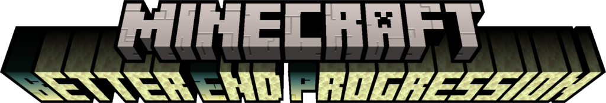

# Welcome to Better End Progression!

Better End Progression (BEP) is a Minecraft mod that that makes it incredibly difficult to acquire your first Eye of
Ender. Further eyes can be easily obtained.

To run the mod locally, set up a fabric modding environment, then run the following:

```bash
./gradlew clean
./gradlew runDatagen
./gradlew runClient
```

To build the mod, run:

```bash
./gradlew clean
./gradlew runDatagen
./gradlew build
```